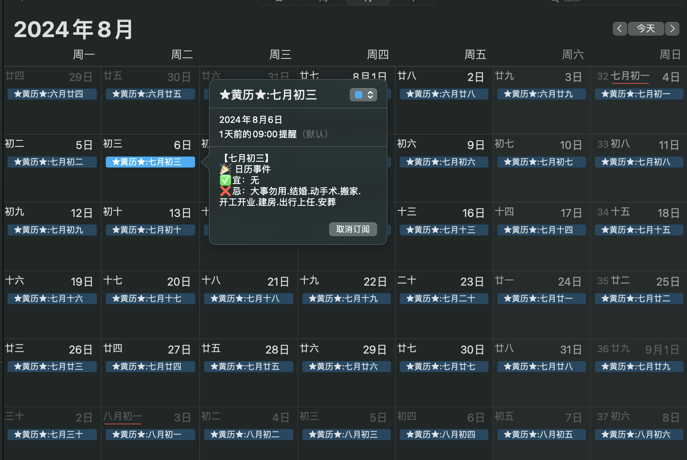

### Holiday and Chinese Almanac Calendar

# 在线订阅问题已解决 可以在线订阅

这个项目提供了中国和国际节假日以及黄历信息，支持在 iOS 日历中订阅。项目特点包括：

- 数据来源于 [OpenApiData](https://github.com/zqzess/openApiData)，确保数据的准确性和可靠性。
- 支持无广告，用户体验友好。
- 覆盖时间范围从 2025 年到 2030 年，涵盖了长期的节假日和黄历信息。
- 可以在 iOS 日历中订阅，方便用户获取最新的节假日和黄历信息。
- 增加神仙圣诞信息
- 增加干支信息

[订阅地址](https://raw.githubusercontent.com/MaxSecurity/holiday-and-chinese-almanac-calendar-Max/main/holidays_calendar_2025-2030.ics)

[国内订阅地址](https://ghfast.top/https%3A//raw.githubusercontent.com/MaxSecurity/holiday-and-chinese-almanac-calendar-Max/main/holidays_calendar_2025-2030.ics)

### 演示信息    

GitHub 项目地址：[MaxSecurity/holiday-and-chinese-almanac-calendar-Max](https://github.com/MaxSecurity/holiday-and-chinese-almanac-calendar-Max)
