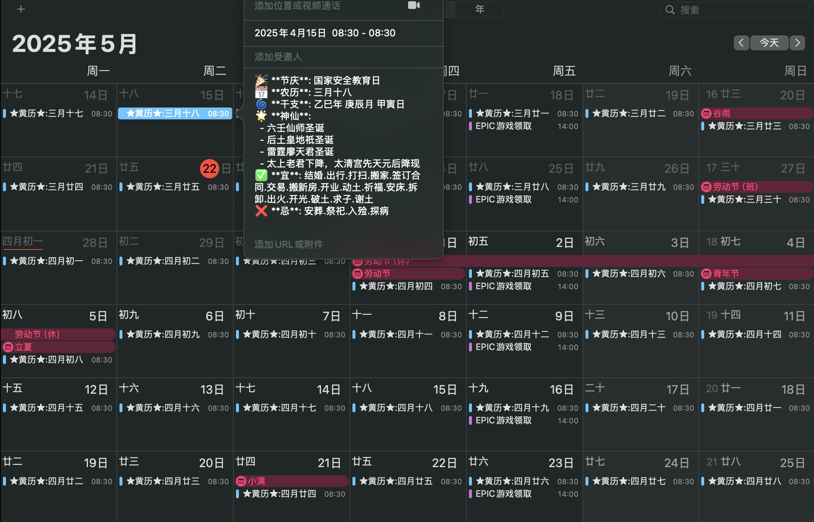

# Holiday and Chinese Almanac Calendar

## 项目概述

本项目提供了中国和国际节假日以及黄历信息，支持在 iOS 日历中订阅。通过整合公开数据和自定义功能，用户可以轻松获取包含农历、节气、神仙圣诞以及干支信息的日历内容。

---

## 项目特点

- **数据来源可靠**：数据来源于 [OpenApiData](https://github.com/zqzess/openApiData)，确保节假日和黄历信息的准确性。
- **覆盖时间范围**：从 2025 年到 2030 年，涵盖了长期的节假日与黄历内容。
- **多维度信息**：提供农历、节气、神仙圣诞以及干支信息，内容丰富。
- **干支支持**：通过 `ganzhi_data.json` 提取每一天的干支信息，精确到日。
- **无广告体验**：完全无广告，专注用户体验。
- **设备兼容性**：特别适配 iOS 系统日历订阅，方便获取最新节假日信息。
- **在线订阅支持**：用户可直接在线订阅，无需手动下载。

---

## 订阅地址

- **通用订阅地址**：[点击订阅](https://raw.githubusercontent.com/MaxSecurity/holiday-and-chinese-almanac-calendar-Max/main/holidays_calendar.ics)
- **国内加速订阅地址**：[国内订阅](https://ghfast.top/https%3A//raw.githubusercontent.com/MaxSecurity/holiday-and-chinese-almanac-calendar-Max/main/holidays_calendar.ics)

---

## 使用方法

1. **添加订阅**：
   - 打开 iOS 设备上的“设置”应用。
   - 依次进入“日历” → “账户” → “添加账户” → “其他” → “添加已订阅的日历”。
   - 输入订阅地址并确认。
2. **查看日历**：
   - 打开设备上的“日历”应用。
   - 确保已启用刚添加的订阅日历。

---

## 数据结构与功能说明

### 1. 数据来源

- **节假日数据**：来自 [OpenApiData](https://github.com/zqzess/openApiData)，包括公共节假日和黄历信息。
- **干支信息**：从本地文件 `ganzhi_data.json` 中提取，格式如下：
  ```json
  {
      "2025-01-01": "甲辰年 丙子月 庚午日",
      "2025-01-02": "甲辰年 丙子月 辛未日"
  }
  ```
  每一天的干支信息均精确到年、月、日。

---

### 2. 项目功能

- **节气和神明信息**：整合 `jieqi.json` 和 `shenxian.json` 数据，提供对应日期的节气与神明诞辰信息。
- **描述清理**：通过正则表达式清除无效字符，优化节庆描述的可读性。
- **iCalendar 文件生成**：支持 `.ics` 文件格式，兼容大多数日历应用。

---

## 项目演示



---

## 技术栈

- **编程语言**：Python
- **主要库**：
  - `icalendar`：用于生成 `.ics` 文件。
  - `json`：处理本地数据文件。
  - `logging`：支持日志记录和调试。
- **数据文件**：
  - `ganzhi_data.json`：存储干支信息。
  - `jieqi.json`：存储节气数据。
  - `shenxian.json`：存储神明诞辰数据。

---

## 贡献与反馈

欢迎通过 [GitHub Issues](https://github.com/MaxSecurity/holiday-and-chinese-almanac-calendar-Max/issues) 提交问题或建议。

---

## 联系方式

GitHub 项目地址：[MaxSecurity/holiday-and-chinese-almanac-calendar-Max](https://github.com/MaxSecurity/holiday-and-chinese-almanac-calendar-Max)
